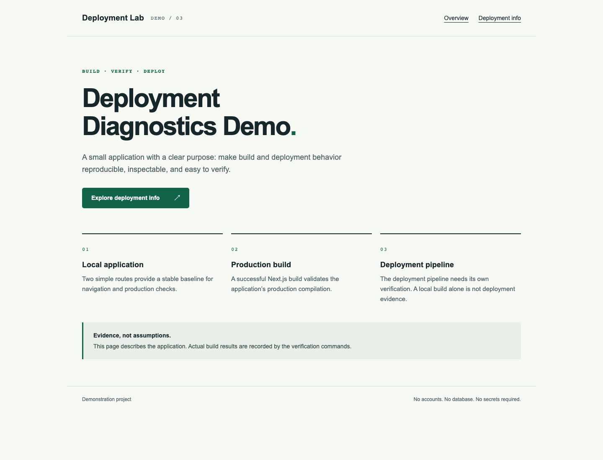

# Next.js Vercel Build Troubleshooting Demo

## Purpose

Demonstration Project for reproducible Next.js build and deployment troubleshooting.

## Stack

Node.js 24.x, Next.js App Router, React, TypeScript, ESLint, Vitest, and Playwright.

## Application

- `/`: application overview and diagnostic principles.
- `/deployment-info`: public application configuration reference.
- Unknown routes return a recoverable 404.

## Troubleshooting Scenario

Deployment validation is separate from local compilation. Evidence and scenario documentation will be recorded after baseline verification.

## Screenshots



Real Chromium browser capture of the local production application. Deployment evidence will be added after the troubleshooting exercise.

## Validation

```sh
npm run verify
npx playwright install chromium
npm run test:e2e
```

`verify` runs unit/integration tests, TypeScript, ESLint, and the Next.js production build. E2E tests start that production build on port 3100; run `verify` first.

## Running Locally

```sh
nvm use
npm ci
npm run dev
```

Open http://localhost:3000. For a production server, run `npm run build` followed by `npm start`.

## Vercel Build Verification

Run `npm run verify:vercel` for the real local Vercel CLI build pipeline. The verifier uses an ignored local configuration fixture without a cloud project ID or credentials.

VERCEL CLOUD PREVIEW: NOT USED — NO SAFE FREE SCOPE AVAILABLE.

Validation mode: LOCAL ONLY.

## Environment Variables

None required. The application does not use accounts, a database, credentials, or external services.

## Project Status

Baseline implementation. LOCAL ONLY: no safe free cloud scope available. No public cloud deployment.

### Dependency audit limitation

The runtime dependency audit (`npm audit --omit=dev`) reports zero advisories at baseline preparation. The pinned Vercel CLI development toolchain still reports upstream advisories; a successful build does not imply a clean toolchain audit. A targeted `tar` override to 7.5.22 removes the critical archive-processing advisory without changing the framework. Review remaining toolchain advisories before processing untrusted projects. No force upgrades or disabled security checks are used.
